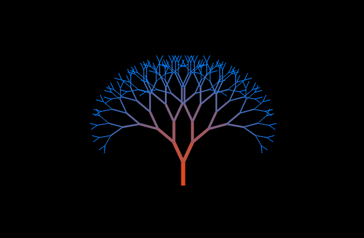
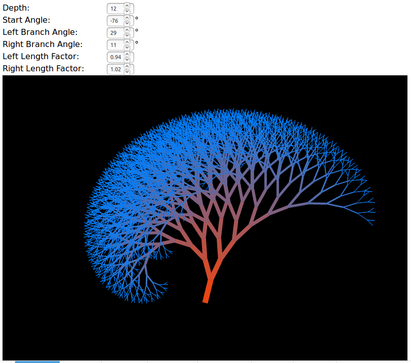
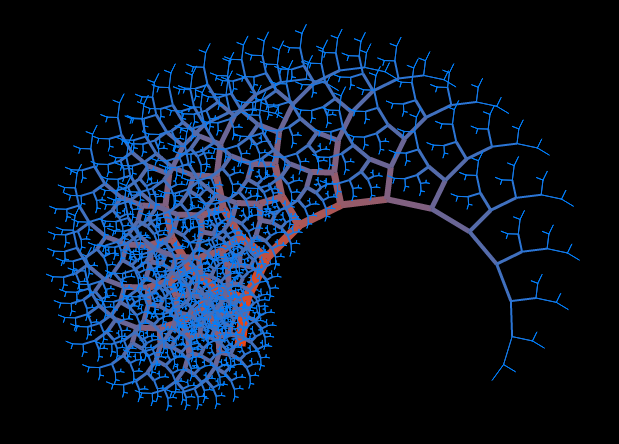
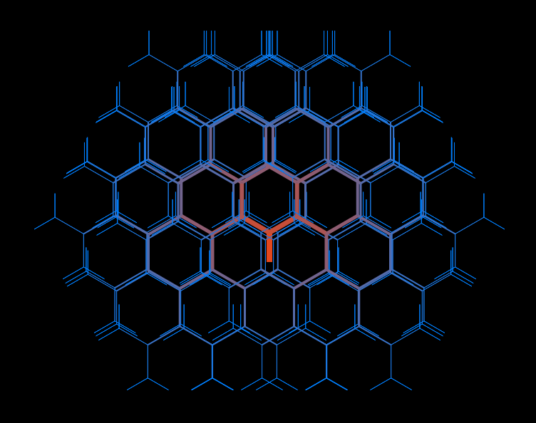

A Binary Tree Fractal Generator
===============================

This is a simple binary tree fractal builder written in javascript.
The algorithm is inspired by https://rosettacode.org/wiki/Fractal_tree

Download and call the main.html to run.

Demo at http://www.int2byte.de/public/fractal-tree/main.html

